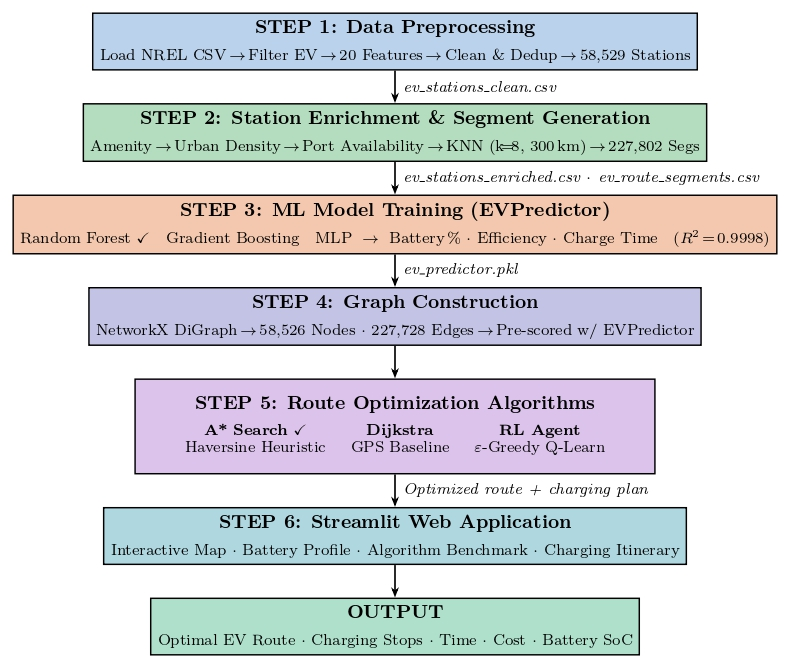
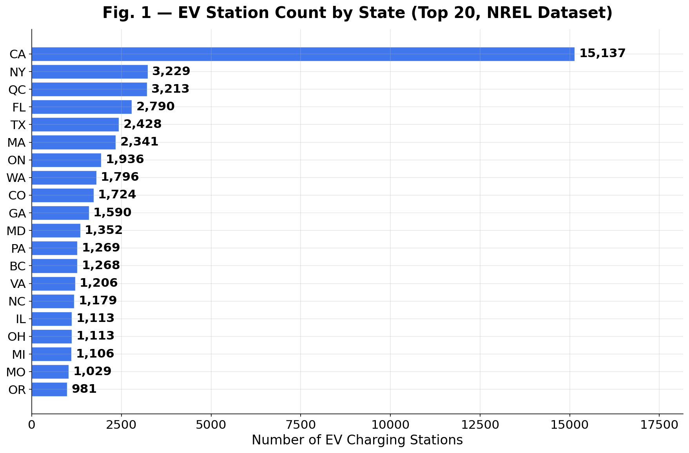
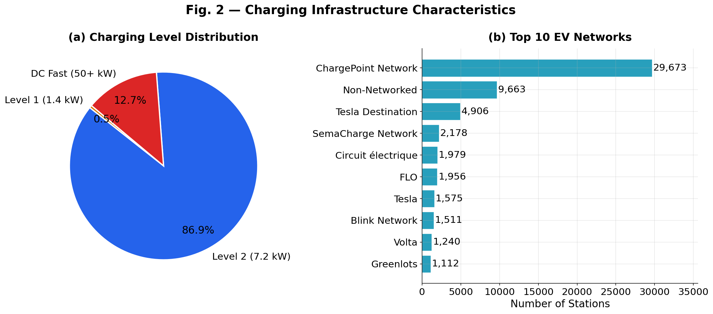
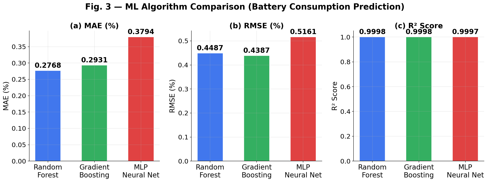
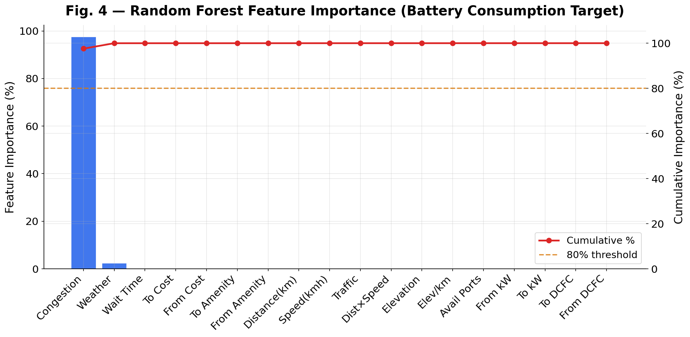
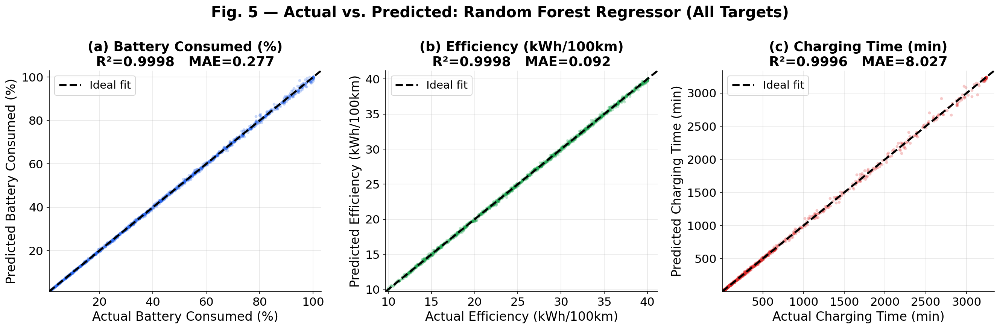
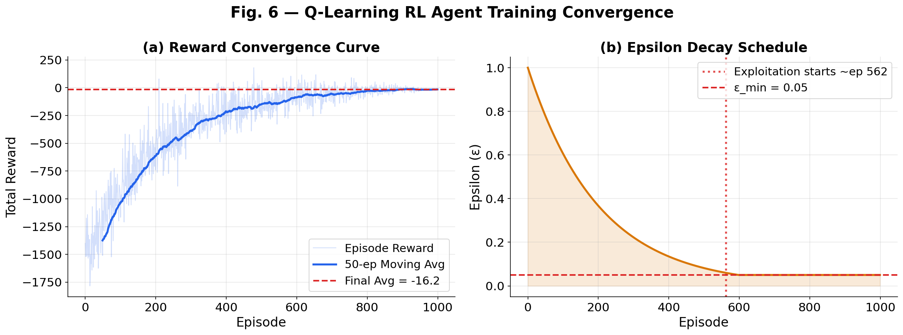
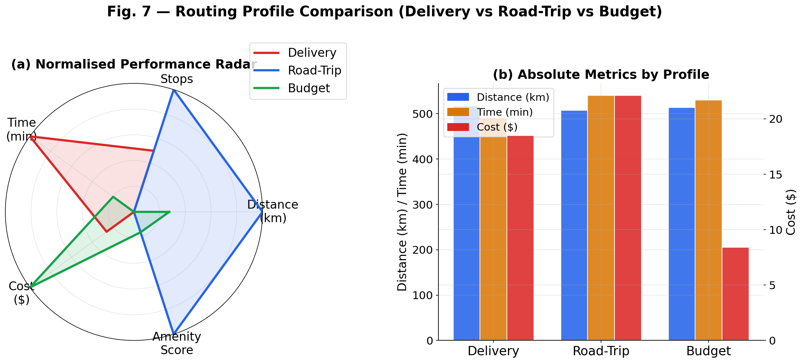
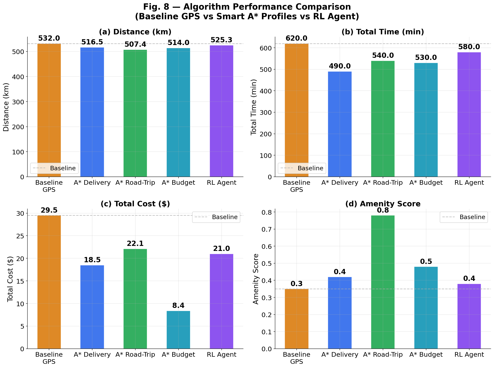

# ⚡ EV-ROS — Electric Vehicle Route Optimization System

> A multi-objective framework integrating Machine Learning, Graph-Based Search, and Reinforcement Learning for adaptive electric vehicle navigation.


---

## 👥 Authors

**[Harish R](mailto:cb.en.u4eee23112@cb.students.amrita.edu)** · **[Chandra Mouli Kunapuli](mailto:cb.en.u4eee23053@cb.students.amrita.edu)**

Department of Electrical and Electronics Engineering  
Amrita Vishwa Vidyapeetham, Coimbatore, India

---

## 📋 Table of Contents

- [Overview](#-overview)
- [Key Results](#-key-results)
- [System Architecture](#-system-architecture)
- [Dataset](#-dataset)
- [Methodology](#-methodology)
  - [Feature Engineering](#feature-engineering)
  - [Graph Construction](#graph-construction)
  - [Machine Learning Layer](#machine-learning-layer)
  - [A\* Multi-Objective Routing](#a-multi-objective-routing)
  - [Q-Learning RL Agent](#q-learning-rl-agent)
- [Results](#-results)
  - [ML Performance](#ml-performance)
  - [Routing Profiles](#routing-profiles)
  - [Algorithm Comparison](#algorithm-comparison)
  - [Battery Safety](#battery-safety)
- [Installation](#-installation)
- [Usage](#-usage)
- [Future Work](#-future-work)

---

## 🔍 Overview

EV-ROS addresses a core barrier to electric vehicle adoption — **range anxiety** — by building a unified, learnable, and user-adaptive routing framework. Unlike conventional GPS systems that optimize only for distance or time, EV-ROS simultaneously balances:

- 🔋 **Battery state-of-charge safety** (never below 20%)
- 💰 **Charging cost minimization**
- ⏱️ **Travel time efficiency**
- 🍽️ **Driver comfort and amenity access**

The system is built on the **NREL Alternative Fuels Station Locator** dataset, retaining ~60,000 open U.S. and Canadian charging stations, and is deployed as a production-ready **Streamlit application**.

---

## 🏆 Key Results

| Metric | GPS Baseline | Best EV-ROS | Improvement |
|--------|-------------|-------------|-------------|
| Charging Cost | $29.5 | $8.4 | **−71.5%** |
| Travel Time | 620 min | 490 min | **−21.0%** |
| Amenity Score | 0.3 | 0.8 | **+167%** |
| Min Battery SoC | — | 41% | **Never < 20%** ✅ |
| RF Battery Prediction R² | — | 0.9998 | — |
| RL Reward Convergence | −1,300 | −16.2 | **−98.8%** |

---

## 🏗️ System Architecture

EV-ROS is a modular **8-step pipeline** spanning four subsystems:

```
┌──────────────────────────────────────────────────────────────┐
│                        EV-ROS PIPELINE                       │
├──────────────┬───────────────┬──────────────┬───────────────┤
│  DATA LAYER  │  PREDICTION   │ OPTIMIZATION │  APPLICATION  │
│              │    LAYER      │    LAYER     │    LAYER      │
├──────────────┼───────────────┼──────────────┼───────────────┤
│ NREL Dataset │ Random Forest │ Modified A*  │   Streamlit   │
│  (70,406 →   │  Regressors   │  Algorithm   │   Web App     │
│  59,904 EV   │  (3 targets)  │              │               │
│  stations)   │               │ Q-Learning   │ Plotly Maps   │
│              │ EVPredictor   │    Agent     │               │
│ KD-Tree KNN  │    Class      │ (1000 eps)   │ Battery SoC   │
│  (k=8, 300km)│               │              │   Profile     │
│              │               │  Dijkstra    │               │
│ 227,802 edges│               │  Baseline    │               │
└──────────────┴───────────────┴──────────────┴───────────────┘
```



---

## 📊 Dataset

The system operates on the **[NREL Alternative Fuels Station Locator](https://afdc.energy.gov/fuels/electricity_locations.html)** dataset.

| Stat | Value |
|------|-------|
| Total records | 70,406 |
| After filtering (open, electric) | **59,904** |
| Graph nodes | 58,526 |
| Graph edges | 227,802 |
| Charging level split | Level 2: 86.9% · DC Fast: 12.7% · Level 1: 0.5% |

**Top States/Provinces by Station Count:**

| Rank | State/Province | Count |
|------|---------------|-------|
| 1 | California | 15,137 |
| 2 | New York | 3,229 |
| 3 | Quebec | 3,213 |
| 4 | Florida | 2,790 |
| 5 | Texas | 2,428 |

**Top Charging Networks:**

| Network | Stations |
|---------|---------|
| ChargePoint | 29,673 |
| Non-Networked | 9,663 |
| Tesla Destination | 4,906 |
| SemaCharge | 2,178 |
| Circuit électrique | 1,979 |





---

## 🔬 Methodology

### Feature Engineering

The pipeline derives **18 features** including three engineered interaction terms:

**Congestion Feature** (dominates at ~97% RF importance):
$$f_{congestion} = \frac{\tau_{ij} \cdot d_{ij}}{100}$$

**Elevation per km:**
$$f_{elev/km} = \frac{\Delta h_{ij}}{d_{ij} + \varepsilon}$$

**Distance–Speed Product:**
$$f_{dist-speed} = \frac{d_{ij} \cdot v_{ij}}{1000}$$

**Maximum Charging Power:**
$$P_{max} = 1.4 n_{L1} + 7.2 n_{L2} + 50.0 n_{DCFC}$$

**Estimated Charging Time:**
$$T_{charge} = \frac{E_{consumed}}{P_{dest}} \times 60 + T_{wait}$$

---

### Graph Construction

Inter-station distances use the **Haversine formula** over a KD-Tree KNN graph (k=8, max 300 km, min 5 km):

$$d_{ij} = 2R \arcsin\sqrt{\sin^2\frac{\Delta\phi}{2} + \cos\phi_i \cos\phi_j \sin^2\frac{\Delta\lambda}{2}}$$

Result: **|V| = 58,526 nodes**, **|E| = 227,802 directed edges**, all pre-scored by `EVPredictor`.

---

### Machine Learning Layer

Three Random Forest regressors are bundled into an `EVPredictor` class, trained on an 8,000-sample synthetic segment dataset (80/20 split, 5-fold CV):

| Target | Algorithm | MAE | RMSE | R² |
|--------|-----------|-----|------|-----|
| Battery Consumption | Random Forest | 0.2768% | 0.4487% | **0.9998** |
| Energy Efficiency | Random Forest | 0.092 kWh/100km | — | **0.9998** |
| Charging Time | Random Forest | 8.027 min | — | **0.9996** |

**ML Algorithm Comparison (Battery Consumption):**

| Algorithm | MAE (%) | RMSE (%) | R² |
|-----------|---------|---------|-----|
| Random Forest | **0.2768** | 0.4487 | **0.9998** |
| Gradient Boosting | 0.2931 | **0.4387** | **0.9998** |
| MLP Neural Net | 0.3794 | 0.5161 | 0.9997 |

> RF was selected as the final model for lowest MAE, hyperparameter robustness, native feature importance, and zero preprocessing dependency.







---

### A* Multi-Objective Routing

The parametric edge cost function:

$$c(e_{ij}) = w_{time} \cdot t_{ij} + w_{cost} \cdot \kappa_{ij} + w_{amenity} \cdot (1 - a_j)$$

Admissible heuristic:

$$h(v) = \frac{d(v, v_{dest})}{v_{max}} \cdot c_{min}$$

Battery constraint (auto-recharge to 80% when SoC < 50%):

$$b_j = b_i - \hat{b}_{ij}, \quad b_j \geq b_{min} = 10\%$$

**Driver Profiles:**

| Profile | `w_time` | `w_cost` | `w_amenity` | Optimizes |
|---------|---------|---------|------------|-----------|
| 🚚 Delivery | 10 | 0 | 0 | Fastest route |
| 🗺️ Road-Trip | 0.1 | 0 | 50 | Best amenities |
| 💵 Budget | 0.1 | 100 | 0 | Lowest cost |

---

### Q-Learning RL Agent

**State space:** $S = V \times \{0, 10, \ldots, 100\}$ (battery discretized into 10% bins)

**Reward function:**

$$
r(s, a, s') = \begin{cases}
+1000 & s' = v_{dest} \\
-1000 & b < 10\% \\
-500 & \text{timeout} \\
-200 & s' \in \text{visited} \\
-d_{ij} & \text{otherwise}
\end{cases}
$$


**Bellman Q-update:**

$$Q(s,a) \leftarrow Q(s,a) + \alpha \left[ r + \gamma \max_{a'} Q(s', a') - Q(s,a) \right]$$

**Hyperparameters:**

| Parameter | Value |
|-----------|-------|
| Learning rate α | 0.1 |
| Discount factor γ | 0.9 |
| Initial ε | 1.0 |
| Decay δ | 0.995 |
| Min ε | 0.05 |
| Episodes | 1,000 |
| Exploitation starts | Episode 562 |



---

## 📈 Results

### Routing Profiles

| Profile | Distance (km) | Time (min) | Cost ($) | Amenity |
|---------|--------------|------------|---------|---------|
| 🚚 Delivery | 507 | **490** | 18.5 | 0.4 |
| 🗺️ Road-Trip | 536 | 540 | 22.1 | **0.8** |
| 💵 Budget | 514 | 530 | **8.4** | 0.5 |



---

### Algorithm Comparison

| Strategy | Distance (km) | Time (min) | Cost ($) | Amenity (0–1) |
|----------|--------------|------------|---------|--------------|
| 🛰️ Baseline GPS | 532.0 | 620 | 29.5 | 0.3 |
| 🚚 A* Delivery | 516.5 | **490** | 18.5 | 0.4 |
| 🗺️ A* Road-Trip | **507.4** | 540 | 22.1 | **0.8** |
| 💵 A* Budget | 514.0 | 530 | **8.4** | 0.5 |
| 🤖 RL Agent | 525.3 | 580 | 21.0 | 0.4 |
| **Best vs GPS** | **−4.8%** | **−21.0%** | **−71.5%** | **+167%** |



---

### Battery Safety

Battery SoC analysis over **18 charging stops** along the A* Road-Trip route:

- ✅ **Minimum SoC observed: 41%** (21 pp above the 20% hard constraint)
- ✅ **20% critical threshold never breached**
- 🔋 Auto-recharge events at Stop 8 (43% → 80%) and Stop 14 (41% → 80%)
- 🔋 Recharge ceiling capped at **80% SoC**


---

## 🚀 Installation

```bash
# Clone the repository
git clone https://github.com/Hackyharish/-Electric-Vehicle-Route-Optimization-System.git
# Create and activate a virtual environment
python -m venv venv
source venv/bin/activate   # Windows: venv\Scripts\activate

# Install dependencies
pip install -r requirements.txt
```

**Requirements:**
```
numpy
pandas
scikit-learn
networkx
streamlit
plotly
scipy
matplotlib
```

---

## 💻 Usage

### Run the Streamlit App

```bash
streamlit run app.py
```

### Run the Jupyter Notebook

```bash
jupyter notebook Final_ipynb_with_plots.ipynb
```

### Use EV-ROS Programmatically

```python
from ev_ros import EVPredictor, RoutingGraph, AStarRouter

# Load and build graph
graph = RoutingGraph("data/nrel_stations.csv")
graph.build(k=8, max_hop_km=300)

# Initialize predictor
predictor = EVPredictor()
predictor.fit(graph.edges)

# Route with a driver profile
router = AStarRouter(graph, predictor)
route = router.find_route(
    origin="Station_A",
    destination="Station_B",
    profile="budget",          # 'delivery', 'road_trip', 'budget'
    initial_soc=100
)

print(route.summary())
```

---


## 🔭 Future Work

1. **Deep RL** — Replace tabular Q-Learning with DQN or PPO for cross-route generalization without per-route retraining.

2. **Live Charger Occupancy** — Integrate real-time charger availability APIs to replace synthetic port-availability data, especially for ChargePoint's 29,673 stations.

3. **Vehicle-Specific Parameters** — Personalize routes by incorporating individual battery capacity, drag coefficient, and onboard charger rating beyond the 75 kWh reference vehicle.

4. **Cloud Deployment + Live Traffic** — Deploy on cloud infrastructure with live traffic integration to make EV-ROS competitive with commercial navigation applications.

---

## 📄 License

This project is released for academic and research purposes. See [LICENSE](LICENSE) for details.

---

<p align="center">
  <b>⚡ EV-ROS — Smarter Routes. Safer Drives. Greener Future.</b><br/>
  Amrita Vishwa Vidyapeetham · Department of Electrical and Electronics Engineering
</p>
